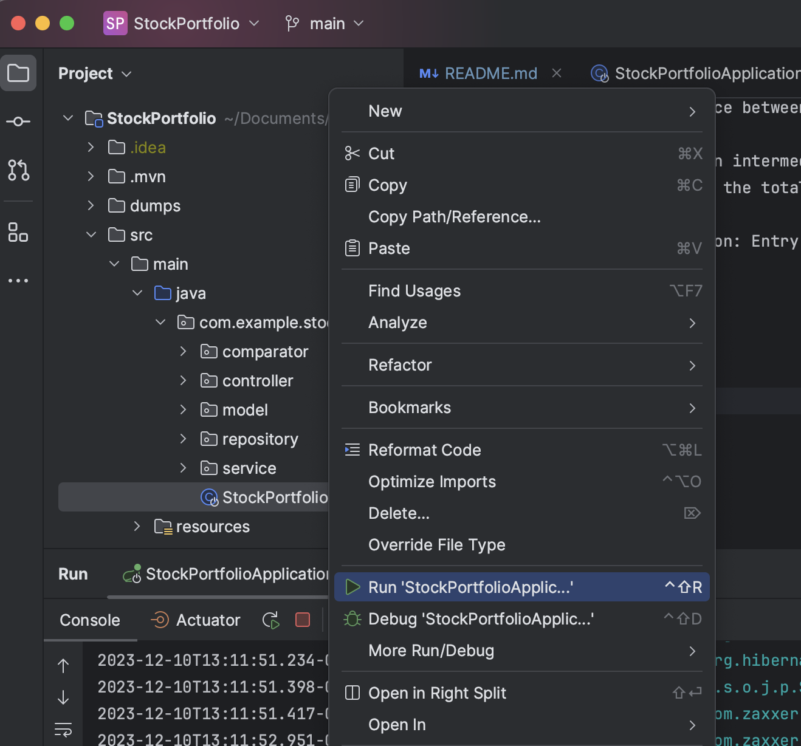

TASK 
StockPortfolio is a CRUD application built in SpringBoot Java.

The home view summarized each investment, with a calculator that  
shows how much of a $10M investment remains. The user can add a fund, 
and filter buttons allow sorting by dollar amount (increasing / decreasing) 
or alphabetical order. The user can also edit the amount invested via  
an update button. 
 
TECHNOLOGY STACK 
* Java 
* Spring Boot 
* Maven 
* Thymeleaf 
* Bootstrap 
* MySQL (and MySQL Workbench) 
   

USER REQUIREMENTS 
The user should be able to:
* Edit the Investment Limit Maximum
* See their total amount invested, and the remaining amount
* Add, Edit, and Delete a stock line (stock, amount)
* Sort stock lexicographically or by amount, ascending or descending
* Make edits/additions through an interface
* Data persistence; see stock after logging out and in

DESIGN 
To create an application with CRUD capability, I used:

IntelliJ Integrated Development Environment:  
* Integration to Git, built-in tools, strong adoption and community
 

Spring Boot
* Sensible defaults and auto-configuration
* Embedded web server (Tomcat) eliminating need for deploying apps to external servers for simpler deployment
* Dependency Injection and Auto-configuration: For ease-of-use
* Create dependency management and build automation
 
Maven for simplified dependency management and IDE integration
* Maven build: maven clean install command
* Maven dependencies: pom.xml

In the application: 
Define routes => Achieved with the stockController class.
* Get Method
* Get Method with Sorting
* Get Method to Add Stock
* Post Method for Added Stock
* Get Method to Edit Stock
* Post Method for Updated Stock
* Get Method to Delete Stock
* Get Method to Edit Total Investment
* Post Method for Edited Total Investment 

Define variables/model methods => Achieved with Stock (model)
* Stock
* ID
* Amount Invested 
  
Manage persistence of Stock entities => Achieved with StockRepository. 
* Interface class acts as an interface between the application code and the underlying database. 

Make calculations (e.g. total investments vs. investment limits) => Achieved with StockService. 

* This class’ methods act as intermediaries between the controller and the database; the methods calculate the total investments, managing investment limits, etc.
* getAllStock method
* findStockById method
* saveStock method
* deleteStockById method
* getTotalAmtInv (get total amount invested) method
* @autowired for automatic dependency injection
  
Have an entry point for the user => Achieved through the StockPortfolioApplication.java:
* Checks if there’s an environment variable ‘PORT’
* Creates a SpringApplication instance, the entry point, and is annotated @SpringBootApplication
* Sets Default Property ‘server.port’ and server address
* Runs the application, starts the Tomcat server and initialized the Spring application context
* Prints a message to indicate application has started successfully

For the interface, the user needs to view pages for home, edit, and add. 
* Used Thymeleaf to create html templates to integrate dynamic data and logic
* Server-side Java template for web for server-side rendering / improved performance
* Integration with Spring Framework Java Backend
* Used Bootstrap in Thymeleaf to style pages
* * addStock.html
* * editStock.html
* * editTotalInvLimit.html
* * showStocks.html
* * stockNotFound.html
  
Data Persistence:
* Integrated MySQL database
* Scalability: Designed for large-scale applications with high volumes of data
* Performance: MySQL is optimized for fast read and write performance, with efficient indexing
* Industry standard and large adoption: Very popular relations database, widely used across various industries
* Tested with MySQL workbench
  
Railway for Deployment:
* I first attempted to deploy my app on AWS, but started incurring significant charges before I was able to complete the deployment. I switched to the simpler Railway Platform as a Service
* Simple deployment and hosting for web applications
* Intuitive platform for deployment; integrated with git
* Cost-effective

 

TO RUN 
Locally
* In IntelliJ IDEA
* * In the StockPortfolioApplication, right click for the menu, then click run  
* * 
 
 
* * Or run from icon
* * 
 
 

Web Application
* In Railway, link https://stockportfolio.up.railway.app/stock  
* This will be the main landing page, showing all stock
* Stock can be viewed by ascending or descending amount
* * 
 
 
* Stock can be sorted by Name, ascending or descending
* * 
 
 
* Stock can be added/edited
* * 
     
* If investment exceeds limit, there will be an error
* * 
 
 

CHALLENGES:
Stock Portfolio challenges
Implementing stock display sorting:
I wanted to implement a sorting interface where there would be an arrow on the header columns (Stock Name and Stock Price), and the user would click on the  arrow to sort by that variable. I unfortunately was not able to implement this in Thymeleaf. My workaround was implementing sort in a get method, and creating buttons for sort for Stock Name and Stock Price.

AWS Deployment:
I attempted to deploy this app on AWS initially. As part of the deployment, I created a virtual database in AWS. Although intended to be a free service, I was charged for both the database as well as the Elastic Compute. I therefore deleted my work out of AWS, and set about deploying on a simpler (more applicable) platform, Railway.

Railway Deployment:
I followed a tutorial to deploy my app on Railway. It seemed very straightforward in that it uses my git repository and some modifications to the application.properties file in Spring Boot. After deploying, my run message displayed, and the error logs did not include any issues with deployment. However, the link to my app displayed an error. Researching the error did not turn up the cause, so I consulted with a colleague. He helped me troubleshoot, and determined I was missing a “PORT” variable. It now runs.

The team:
Written primarily by me. However, I did consult with a colleague well-versed in deployment in order to deploy to Railway.

